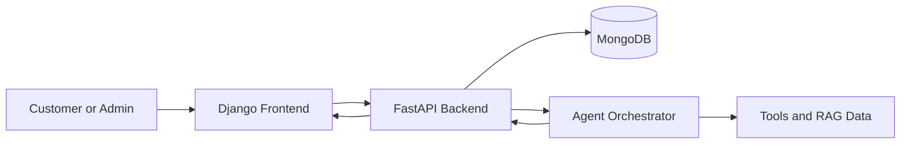

# The-mRu-Store

The-mRu-Store is a dual-app e-commerce demo that combines a FastAPI backend, a Django storefront, and an AI assistant layer. The project is designed around conversational shopping and store operations: customers can search products, manage carts, place orders, and open support tickets, while admins can use an AI assistant for analytics and inventory visibility.

## Project Overview

The core runtime flow is:

User or admin interface -> Django frontend -> FastAPI API -> MongoDB -> AI agent and tool layer -> response back to the UI

The FastAPI app is the primary application backend. It exposes domain routers for products, categories, search, cart, orders, reviews, support tickets, recommendations, preferences, users, auth, analytics, and chat. The chat route hands off to the agent orchestrator, which decides what tools to call and how to turn the results into a response.

The Django app provides the storefront, account pages, admin screens, and proxy endpoints that forward requests to the FastAPI backend. It is the user-facing web layer for browsing and manual testing.

MongoDB is the main data store. The shared database namespace is `amazon_clone_db`, and it is accessed from both the async FastAPI layer and the Django frontend helpers.

## What This Project Is For

- Conversational e-commerce interactions for customers and admins.
- Retrieval-augmented search and product discovery.
- Tool-based AI workflows for orders, carts, support, and business analytics.
- A practical demo environment for testing chat-driven commerce flows end to end.

## Main Components

- FastAPI backend: serves API routes and business logic.
- Agent layer: selects tools, manages product IDs, and coordinates multi-step responses.
- Django frontend: storefront pages, auth pages, admin pages, and API proxies.
- MongoDB persistence: stores products, users, carts, orders, chat sessions, and analytics data.
- Scripts: data seeding, vector backfilling, ingestion, migration, and cleanup utilities.
- Testing: API and workflow validation scripts.

## Architecture



The AI layer is split into two modes:

- Customer assistant: product discovery, recommendations, cart actions, order checks, and support tickets.
- Admin assistant: business analytics, inventory visibility, order summaries, and ticket summaries.

The assistant logic is implemented in code, not just prompt text. That includes product-ID tracking, tool routing, and session-aware chat handling in `agent/orchestrator.py`.

## Full Project Structure

```text
The-mRu-store/
├── CHANGELOG.md                        Project change history
├── README.md                           Project overview, setup, and structure guide
├── index.html                          Standalone front-page or demo entry file
├── main_db_server.py                   FastAPI application entry point
├── pytest.ini                         Pytest configuration
├── requirements.txt                   Python dependency list
├── agent/                             AI orchestration and tool definitions
│   ├── __init__.py                    Marks the package as importable
│   ├── admin_tools.py                 Admin-facing tool set and system prompt helpers
│   ├── orchestrator.py                Multi-round agent loop and product-ID registry
│   └── tools.py                       Customer-facing e-commerce tool set
├── backend/                           FastAPI application code and database access
│   ├── __init__.py                    Backend package marker
│   ├── api/                          Domain routers exposed by FastAPI
│   │   ├── __init__.py               API package marker
│   │   ├── admin_analytics.py       Admin analytics endpoints
│   │   ├── analytics.py             General analytics endpoints
│   │   ├── auth.py                  Login and registration endpoints
│   │   ├── cart.py                  Cart management endpoints
│   │   ├── categories.py           Category browsing endpoints
│   │   ├── chat.py                 Customer and admin chat endpoints
│   │   ├── inventory.py            Inventory lookup and alerts
│   │   ├── ml_core.py              Shared ML/search helpers
│   │   ├── orders.py               Order placement and lookup endpoints
│   │   ├── preferences.py         User preference storage and retrieval
│   │   ├── products.py             Product catalog endpoints
│   │   ├── recommendations.py      Recommendation endpoints
│   │   ├── reviews.py              Product review endpoints
│   │   ├── search.py               Keyword and hybrid search endpoints
│   │   ├── support_tickets.py      Support ticket endpoints
│   │   └── users.py                User profile and account endpoints
│   └── db/                          Shared MongoDB access helpers
│       ├── __init__.py             Database package marker
│       ├── chat_repository.py      Chat session storage and lookup
│       └── database.py             Async MongoDB client and shared database handle
├── docs/                             Reference documents and static assets
│   ├── static/                      Non-code assets used by the project
│   │   ├── The-mRu_Store_FAQ.pdf   FAQ/reference document
│   │   └── policy.docx             Policy or store rules reference
│   └── structured/                  Placeholder for structured documentation exports
├── frontend/                         Django project and storefront app
│   ├── db.sqlite3                   Local Django development database
│   ├── manage.py                    Django command-line entry point
│   ├── media/                      Uploaded media files
│   │   └── profile_pics/           User profile image uploads
│   ├── mru_project/                Django project configuration
│   │   ├── __init__.py             Django package marker
│   │   ├── asgi.py                 ASGI application entry point
│   │   ├── settings.py             Django settings and local development config
│   │   ├── urls.py                 Root URL routing
│   │   └── wsgi.py                 WSGI application entry point
│   └── store/                      Django app for storefront and admin pages
│       ├── __init__.py             Store app package marker
│       ├── admin.py                Django admin registrations
│       ├── apps.py                 App configuration
│       ├── db.py                  Store-facing database helpers
│       ├── forms.py               Registration and form definitions
│       ├── models.py              Django models, if used locally
│       ├── services.py            HTTP helpers that call FastAPI
│       ├── tests.py               Django app tests
│       ├── urls.py                Store routes and admin routes
│       ├── views.py               Page rendering and API proxy views
│       ├── migrations/           Django migration files
│       │   └── __init__.py       Migration package marker
│       ├── static/               App static assets
│       │   └── images/           Store images and screenshots
│       └── templates/            Django HTML templates
│           ├── registration/    Password reset templates
│           │   ├── password_reset_complete.html
│           │   ├── password_reset_confirm.html
│           │   ├── password_reset_done.html
│           │   └── password_reset_form.html
│           └── store/           Storefront, admin, and component templates
│               ├── base.html
│               ├── cart.html
│               ├── catalog.html
│               ├── chat.html
│               ├── chatbot.html
│               ├── checkout.html
│               ├── dashboard.html
│               ├── footer.html
│               ├── login.html
│               ├── navbar.html
│               ├── order_detail.html
│               ├── order_history.html
│               ├── order_success.html
│               ├── product_detail.html
│               ├── register.html
│               ├── search.html
│               ├── settings.html
│               ├── shop.html
│               ├── admin/
│               │   ├── add_product.html
│               │   ├── admin_base.html
│               │   ├── ai_assistant.html
│               │   ├── dashboard.html
│               │   ├── edit_product.html
│               │   ├── login.html
│               │   ├── order_details.html
│               │   ├── orders.html
│               │   └── products.html
│               └── components/
│                   ├── breadcrumb.html
│                   ├── modal.html
│                   ├── skeleton_card.html
│                   └── spinner.html
├── scripts/                          One-off utilities and maintenance jobs
│   ├── backfill_vectors.py           Recompute product embeddings
│   ├── eval_hallucination.py         Evaluate response accuracy/hallucination risk
│   ├── eval_tool_success.py          Evaluate tool-call success rates
│   ├── fix_brands.py                 Repair brand data issues
│   ├── fix_duplicate_order_ids.py    Repair duplicate order identifiers
│   ├── fixing.py                    General cleanup or repair script
│   ├── flag_bad_seed_products.py     Flag problematic seeded products
│   ├── ingest_docs.py               Ingest docs for RAG/search
│   ├── migrate_legacy_orders.py      Move older order records into the current schema
│   ├── migrate_to_atlas.py           MongoDB Atlas migration helper
│   └── seed_data.py                 Seed demo users, products, and orders
└── testing/                          API and workflow validation scripts
	├── api_testing1.py               API smoke test script
	├── diagnose_precision.py         Retrieval quality diagnostics
	├── eval_retrieval.py             Retrieval evaluation script
	├── test_admin_analytics.py       Admin analytics tests
	├── test_all_api.py               Broad API coverage test
	├── test_cart.py                  Cart workflow tests
	├── test_embedding.py             Embedding-related checks
	├── test_orders.py                Order workflow tests
	├── test_search.py                Search endpoint tests
	└── test_support_tickets.py       Support ticket workflow tests
```

## Key Files To Know First

- `main_db_server.py`: creates the FastAPI app and mounts every backend router.
- `agent/orchestrator.py`: runs the assistant loop, manages tool calls, and protects real product IDs.
- `backend/api/chat.py`: receives chat messages, loads or creates chat sessions, and invokes the agent.
- `backend/db/chat_repository.py`: stores and retrieves chat session history in MongoDB.
- `frontend/manage.py`: Django entry point for running the storefront locally.
- `frontend/mru_project/settings.py`: Django settings, database config, and local development behavior.
- `frontend/store/views.py`: storefront pages, auth flow, chat proxies, and admin page handlers.
- `frontend/store/services.py`: HTTP client helpers that call the FastAPI backend from Django.

## Tool Inventory

### Customer Tools

| Pillar | Tools |
|--------|-------|
| Product Discovery | `ai_omni_search`, `get_product_by_id`, `list_categories`, `list_brands`, `get_product_reviews` |
| Recommendations | `recommend_products`, `compare_products`, `get_similar_products` |
| Cart & Checkout | `manage_cart` |
| Orders | `check_order_status`, `get_user_orders`, `get_order_items` |
| Support Tickets | `create_support_ticket`, `check_ticket_status`, `add_ticket_comment`, `close_support_ticket`, `escalate_ticket`, `get_user_tickets` |
| Personalization | `remember_preference`, `get_user_preferences`, `get_personalized_recommendations`, `get_recently_discussed` |
| Store Policy | `search_store_policy` |

### Admin Tools

| Category | Tools |
|----------|-------|
| Dashboard | `get_business_summary`, `get_sales_analytics` |
| Products | `get_top_selling_products`, `get_product_performance` |
| Inventory | `get_inventory_alerts` |
| Orders | `get_order_status_breakdown` |
| Tickets | `get_pending_tickets_summary` |
| Business Queries | `natural_language_business_query` |

## Quickstart

1. Clone the repository and enter it:

```bash
git clone <your-repo-url>
cd The-mRu-store
```

2. Create and activate a virtual environment on Windows:

```powershell
python -m venv .venv
.venv\Scripts\Activate.ps1
```

3. Install dependencies:

```bash
pip install -r requirements.txt
```

4. Add your environment variables in `.env` or your shell. The important ones are:

- `OPENAI_API_KEY`
- `MONGO_URI`
- `MONGO_DB_NAME`

5. Start the FastAPI backend:

```bash
uvicorn main_db_server:app --reload
```

6. Start the Django frontend in a second terminal if you want the storefront UI:

```bash
cd frontend
python manage.py migrate
python manage.py runserver 8080
```

## Data And AI Setup

These helper scripts prepare demo data and retrieval assets:

```bash
python scripts/seed_data.py
python scripts/backfill_vectors.py
python scripts/ingest_docs.py
```

If you skip these scripts, the app can still run, but chat quality and search coverage may be limited.

## Notes

- The backend is the source of truth for APIs and AI orchestration.
- The Django app is the presentation layer and request proxy layer.
- Product ID handling is server-side to prevent fabricated IDs from reaching the tools.
- The repo includes both interactive app code and standalone scripts for maintenance, evaluation, and migration.
